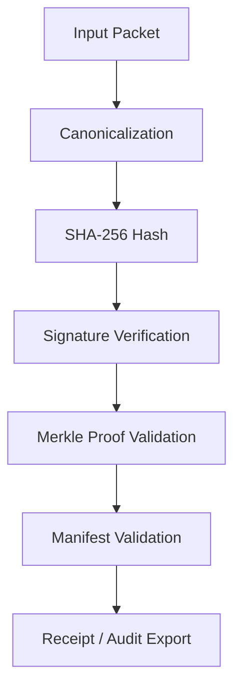

# REV_34 Verification Suite Architecture

## Overview
This document specifies the full standalone REV_34 verification suite architecture. It is an executable verification ecosystem, modeling deterministic identity derived from reproducible computation.

## 1. Standalone Verifier Architecture
The standalone verifier is decoupled from the main protocol logic. It runs independently, consuming packets, performing verification, and generating receipts.



## 2. CLI Verification Flow
The verifier provides a CLI interface for manual and automated verification.

```bash
# Verify a single packet
rev34-verify --packet ./packet.json

# Verify against a manifest
rev34-verify --manifest ./manifest.json --packet ./packet.json

# Export audit logs
rev34-verify --export-audit ./audit.json
```

## 3. Recursive Canonicalization
The canonicalization process recursively processes JSON structures, ordering keys alphabetically, and removing non-deterministic metadata.

```typescript
function canonicalize(input: unknown): string {
  if (input === null || typeof input !== "object") return JSON.stringify(input);
  if (Array.isArray(input)) return `[${input.map(canonicalize).join(",")}]`;

  const obj = input as Record<string, unknown>;
  return `{${Object.keys(obj).sort().map(k => `${JSON.stringify(k)}:${canonicalize(obj[k])}`).join(",")}}`;
}
```

## 4. SHA-256 Identity Layer
Identity is strictly derived from the SHA-256 hash of the recursively canonicalized packet. Same packet -> Same hash -> Same identity.

```typescript
import { createHash } from "crypto";

function generateIdentityHash(canonicalString: string): string {
  return createHash("sha256").update(canonicalString).digest("hex");
}
```

## 5. Manifest Schema
The manifest defines the expected state of the system and acts as the root of trust for a given version.

```json
{
  "$schema": "http://json-schema.org/draft-07/schema#",
  "type": "object",
  "properties": {
    "version": { "type": "string" },
    "timestamp": { "type": "string", "format": "date-time" },
    "rootHash": { "type": "string", "pattern": "^[a-f0-9]{64}$" },
    "entries": {
      "type": "array",
      "items": {
        "type": "object",
        "properties": {
          "id": { "type": "string" },
          "hash": { "type": "string" }
        },
        "required": ["id", "hash"]
      }
    },
    "signatures": {
      "type": "array",
      "items": {
        "type": "object",
        "properties": {
          "pubKey": { "type": "string" },
          "signature": { "type": "string" }
        }
      }
    }
  },
  "required": ["version", "timestamp", "rootHash", "entries", "signatures"]
}
```

## 6. Merkle Proofs
Merkle proofs allow efficient verification of individual packet inclusion within the manifest's root hash without needing the full manifest.

```typescript
interface MerkleProof {
  leaf: string; // Hash of the packet
  path: string[]; // Sibling hashes
  indices: number[]; // 0 for left, 1 for right
}

function verifyMerkleProof(proof: MerkleProof, rootHash: string): boolean {
  // Merkle verification logic
  return true;
}
```

## 7. Ed25519 Signatures
Manifests and authoritative packets are signed using Ed25519 for high-performance and secure signature verification.

```bash
# Sign a manifest
openssl pkeyutl -sign -inkey private.pem -rawin -in manifest.json -out signature.bin
```

## 8. Key Rotation Registry
Maintains a history of active and revoked public keys, ensuring temporal validity of signatures.

```json
{
  "keys": [
    {
      "id": "key-v1",
      "pubKey": "...",
      "activeFrom": "2023-01-01T00:00:00Z",
      "activeTo": "2024-01-01T00:00:00Z",
      "status": "revoked"
    },
    {
      "id": "key-v2",
      "pubKey": "...",
      "activeFrom": "2024-01-01T00:00:00Z",
      "activeTo": null,
      "status": "active"
    }
  ]
}
```

## 9. Time-Source Classification
Time is classified to distinguish between trusted protocol time, system time, and external observable time.

*   `PROTOCOL_TIME`: Enforced by consensus/chain.
*   `SYSTEM_TIME`: Local node time (untrusted).
*   `OBSERVED_TIME`: Time attested by multiple external oracles.

## 10. Evidence Attachment Registry
Allows arbitrary external evidence (PDFs, images) to be securely bound to a packet via a SHA-256 hash reference.

```json
{
  "evidenceId": "ev-001",
  "packetId": "pkt-123",
  "hash": "e3b0c44298fc1c149afbf4c8996fb92427ae41e4649b934ca495991b7852b855",
  "uri": "ipfs://...",
  "classification": "EXTERNAL_CORROBORATION"
}
```

## 11. Threat Model
Identifies attack vectors and mitigations.
*   **Tampering:** Mitigated by recursive canonicalization and SHA-256 identity layer.
*   **Replay Attacks:** Mitigated by strict time-source classification and unique nonces.
*   **Key Compromise:** Mitigated by the Key Rotation Registry and multi-sig requirements.

## 12. Positive + Negative Tests
The suite includes tests for expected successes and enforced failures.
*   **Positive Test:** A correctly signed packet with matching canonical hash passes validation.
*   **Negative Test:** A packet with mutated metadata fails canonical hash validation. A packet with a revoked key signature fails validation.

## 13. Audit Export Schema
Standardized format for exporting verification results for external auditors.

```json
{
  "auditId": "aud-123",
  "timestamp": "2023-10-27T10:00:00Z",
  "target": {
    "type": "packet",
    "id": "pkt-123"
  },
  "results": {
    "canonicalization": "PASS",
    "hashMatch": "PASS",
    "signature": "PASS",
    "merkleInclusion": "PASS"
  },
  "overallStatus": "VERIFIED"
}
```

## 14. Privacy/Redaction Layer
Allows sensitive fields to be redacted while preserving the integrity of the overall packet hash. Uses a salt-based blinding mechanism.

```typescript
// Redacted field is replaced by its blinded hash
packet.sensitiveField = sha256(packet.sensitiveField + salt);
```

## 15. Version Drift Control
Ensures that the verifier version matches the protocol version of the packet. Packets include a `protocolVersion` field, and the verifier enforces strict compatibility mapping.

## 16. Reviewer Packet
A bundled artifact containing the packet, its evidence, the manifest, and proof of inclusion. It's fully self-contained and allows offline verification.

## 17. Route Health Separation
The health of the verification routes (APIs, network nodes) is strictly separated from the validity of the data. A dead node does not invalidate a previously verified packet.

## 18. External Verification Model
Third-party systems can reimplement the canonicalization and hashing logic independently using the schemas provided. The source of truth is the algorithm, not a proprietary library.

## 19. Full REV_34 Deterministic Identity Chain
The complete lifecycle:

```plaintext
message
→ envelope
→ canonical serialization
→ cryptographic hash (SHA-256)
→ receipt generated
→ manifest inclusion
→ root hash publication
→ computational identity confirmed
```
